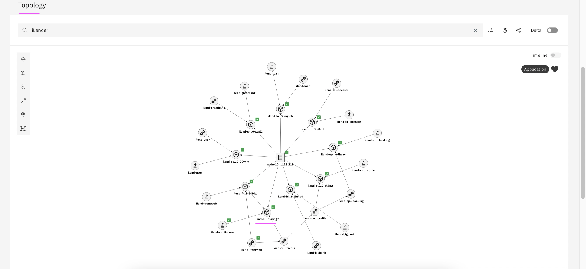

# WAIOps Demo with Instana and iLender App : 4 - Application and AI-Model Management and Training

This article explains about following as part of the Watson AIOps demo setup with Instana and iLender App.

- Application Management
- AI-Model Management 
- Training

The article is based on the the following.

- RedHat OpenShift 4.6.x / 4.7.x on IBM Cloud (ROKS)
- Watson AIOps 3.1.x

## 1. Application Management

This section explains about application creation in Watson AIOps.

For detailed explanation refer https://github.com/ibm-gsi-ecosystem/watson-ai-ops-310-guide/tree/main/310-aiops-application-management/01-create-application

1. Create Kubernetes Observer for the app


2. Create Application using the observed group.

3. The application would look like this.




## 2. AI-Model Management 

This section explains about training definition to be created for Logs, Events and Similar Incidents.

### 2.1 Create Training Definition for Log Anomaly

Refer https://github.com/ibm-gsi-ecosystem/watson-ai-ops-310-guide/tree/main/320-aiops-ai-model-management/10-create-training-definition-log-anomaly

### 2.2 Create Training Definition for Event Grouping

Refer https://github.com/ibm-gsi-ecosystem/watson-ai-ops-310-guide/tree/main/320-aiops-ai-model-management/11-create-training-definition-event-grouping

### 2.3 Create Training Definition for Similar Incidents

Refer https://github.com/ibm-gsi-ecosystem/watson-ai-ops-310-guide/tree/main/320-aiops-ai-model-management/12-create-training-definition-incidents

## 3. Training

This section explains about Training Steps required for Logs, Events and Similar Incidents.

### 3.1. Training - Log Anomaly Detection

Refer the steps given in the below url. 

https://github.com/ibm-gsi-ecosystem/watson-ai-ops-310-guide/tree/main/330-aiops-training/10-log-anomaly-detection-training

Note: For creating load in the application, refer the steps given below.

#### Creating load in the app

1. Open the [run-load.sh](./files/run-load.sh) file.

2. Update the below property with the right url of the application.

    ```
    export P_HOST=http://1.1.1.4:30500
    ```

3. When you want to create load in the app, run the below command.

    ```
    sh run-load.sh
    ```

### 3.2. Training - Event Grouping

Refer the steps given in the below url. 

https://github.com/ibm-gsi-ecosystem/watson-ai-ops-310-guide/tree/main/330-aiops-training/11-event-grouping-training


### 3.3. Training - Similar Incidents

Refer the steps given in the below url. 

https://github.com/ibm-gsi-ecosystem/watson-ai-ops-310-guide/tree/main/330-aiops-training/12-similar-incidents-training


To create sample ServiceNow incidents for Similar Incidents in Watson AIOps, refer the below url

https://community.ibm.com/community/user/aiops/blogs/jeya-gandhi-rajan-m1/2021/09/08/snow-waiops-1-create-snow-incidents


## Navigation

Prev: [Data and Tool Integrations](https://community.ibm.com/community/user/aiops/blogs/jeya-gandhi-rajan-m1/2021/09/21/waiops-ins-ilender-3-data-tool-integration)

Next: [Inferencing](https://community.ibm.com/community/user/aiops/blogs/jeya-gandhi-rajan-m1/2021/09/21/waiops-ins-ilender-5-inferencing)

Home: [Overview](https://community.ibm.com/community/user/aiops/blogs/jeya-gandhi-rajan-m1/2021/09/21/waiops-ins-ilender-1-overview)


#### Released by :
- Jeya Gandhi Rajan M
- Vijaya Bhaskar R Siddareddi
- Vijay Sukthankar (Squad Leader)

Hybrid-Cloud Squad, GSI Labs

#ibmautomation