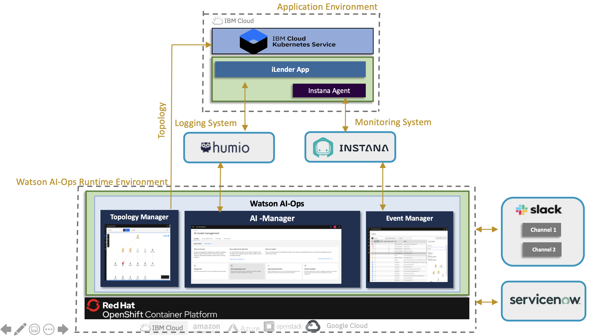

# Watson AIOps Demo Setup with Instana and iLender App

This article explains about step by step process involved in setting up `Watson AIOps` Demo with `Instana` and `iLender` Application.

The article is based on the the following.

- RedHat OpenShift 4.6.x / 4.7.x on IBM Cloud (ROKS)
- Watson AIOps 3.1.x

## Overview

iLender is a Microservices based Loan processing application used by a FinTech company. This application is deployed in a kubernetes environment. 

The application pushses logs to `Humio` logging system. 

The managed environment is monitored using the `Instana` monitoring system.

`Watson AIOps 3.1.x` is installed on ROKS and it is connected to these `Humio` and `Instana`. Apart from these, it is also connected to `ServiceNow` and ChatOps `Slack`

Here are steps to be done for this demo setup.

- Initial configuration or tools installation including the iLender app 
- Integrate external tools in WAIOps
- Import application topology from managed environment and create application in WAIOps
- Create AI Model definition
- Training of Normal Logs, events and Similar incidents
- Induce error in the iLender Application (memory high issue in CreditScore Service) and view the slack story and servicenow incident.

## Initial Configuration

This section explains about the Initial Configuration or tools installation required to do the demo setup. This section also explains about how to install the iLender application.

Refer : [Initial Configuration](https://community.ibm.com/community/user/aiops/blogs/jeya-gandhi-rajan-m1/2021/09/21/waiops-ins-ilender-2-initial-configuration)

## Data and tool integrations

This section explains about the below tools integrations with Watson AIOps.

- Humio (log)
- Kafka (Event Manager)
- ServiceNow (Incidents)
- Slack (Story)

Refer : [Data and Tool Integrations](https://community.ibm.com/community/user/aiops/blogs/jeya-gandhi-rajan-m1/2021/09/21/waiops-ins-ilender-3-data-tool-integration)

## Application and AI-Model Management and Training

This section explains about following as part of the demo setup of Watson AIOps with Instana and iLender App.

- Application Management

- AI-Model Management
- Training

Refer : [App and AI Model Management and Training](https://community.ibm.com/community/user/aiops/blogs/jeya-gandhi-rajan-m1/2021/09/21/waiops-ins-ilender-4-app-aimodel-training)

## Inferencing

This section explains about Inducing error in the iLender Application (memory high issue in CreditScore Service), get alert from Instana, log anomaly from Humio through AIManager and view the slack story and servicenow incident.

Refer : [Inferencing](https://community.ibm.com/community/user/aiops/blogs/jeya-gandhi-rajan-m1/2021/09/21/waiops-ins-ilender-5-inferencing)

## Navigation

Next: [Initial Configuration](https://community.ibm.com/community/user/aiops/blogs/jeya-gandhi-rajan-m1/2021/09/21/waiops-ins-ilender-2-initial-configuration)

Home: [Overview](https://community.ibm.com/community/user/aiops/blogs/jeya-gandhi-rajan-m1/2021/09/21/waiops-ins-ilender-1-overview)

#### Released by :
- Jeya Gandhi Rajan M
- Vijaya Bhaskar R Siddareddi
- Vijay Sukthankar (Squad Leader)

Hybrid-Cloud Squad, GSI Labs

#ibmautomation

